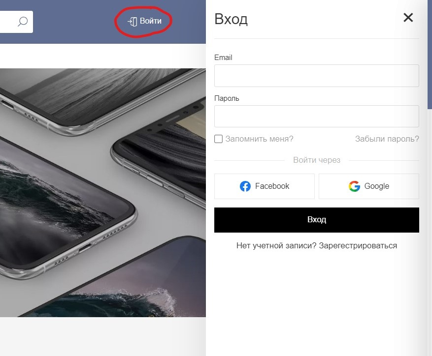
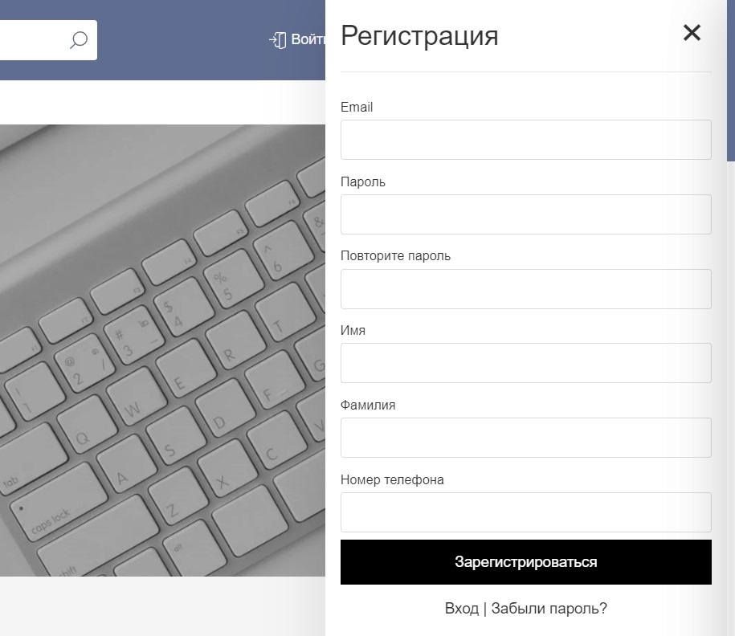
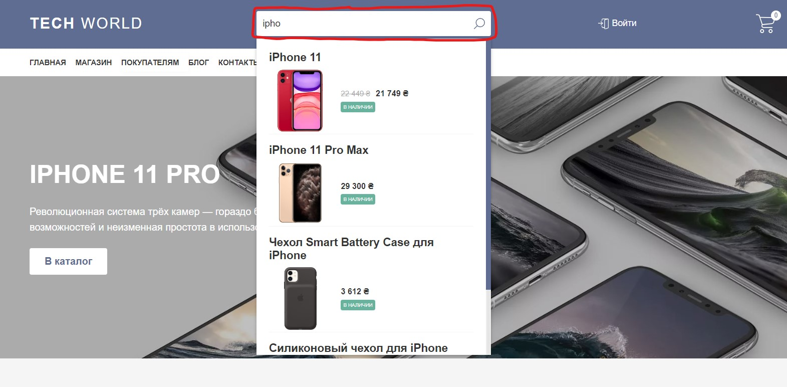
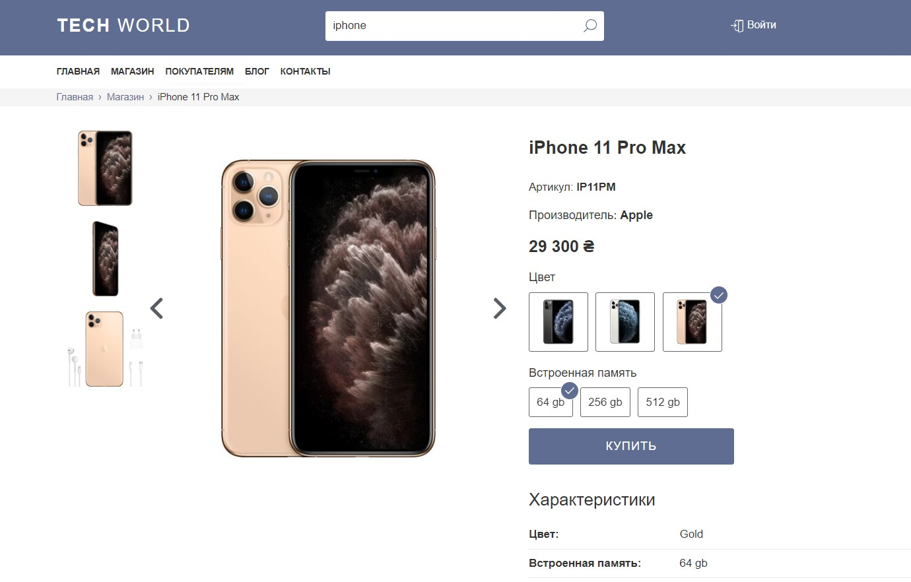
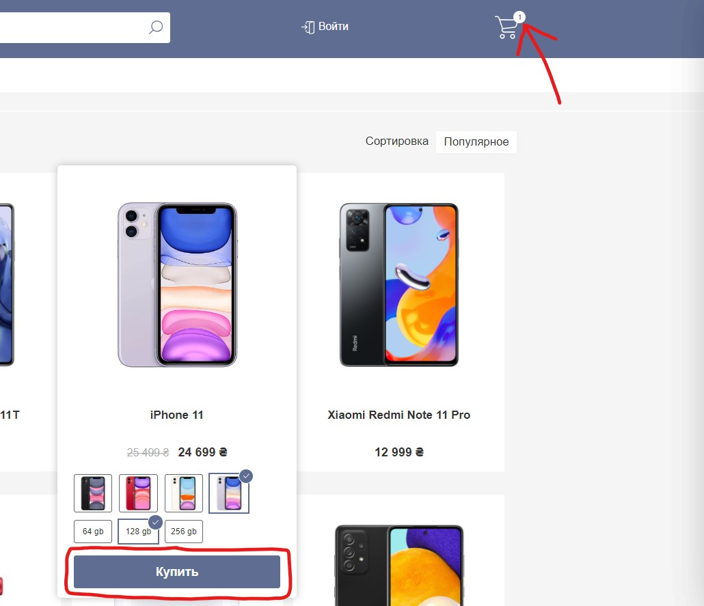
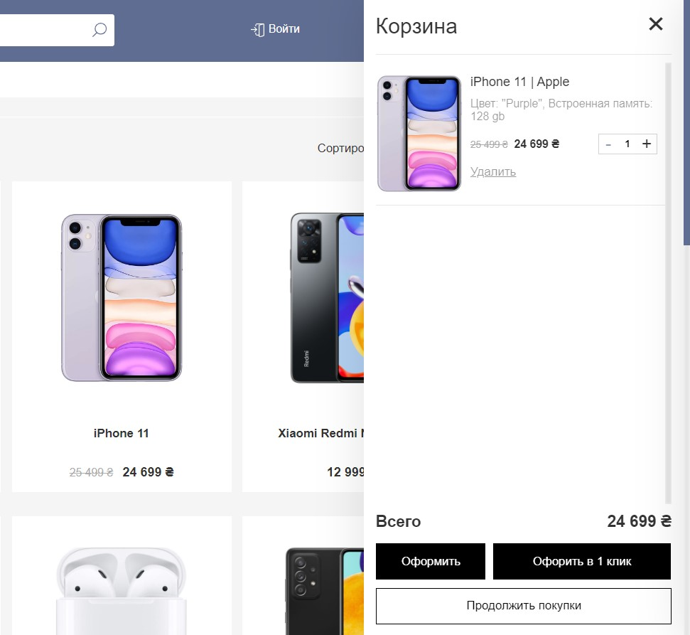
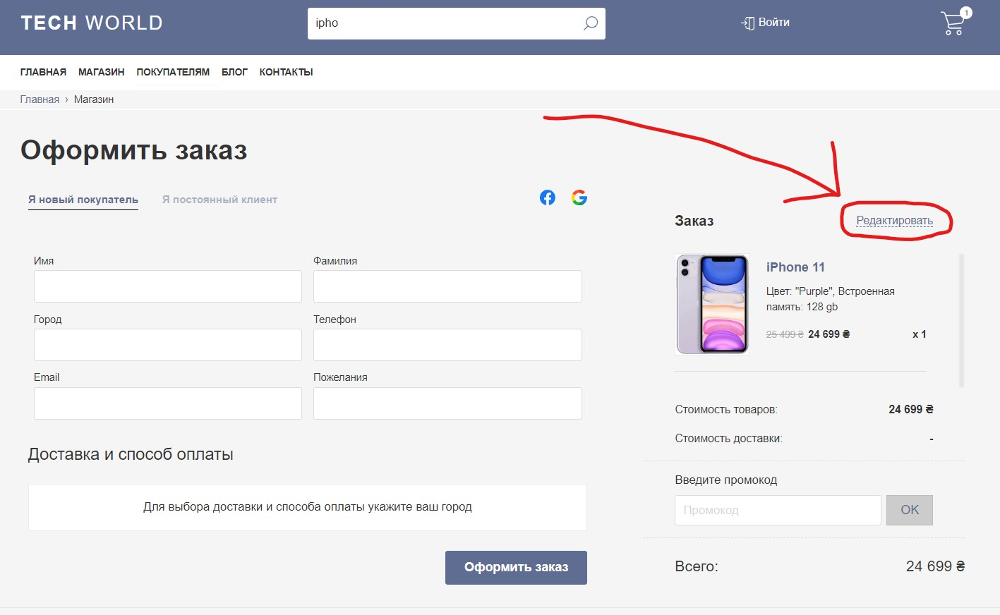
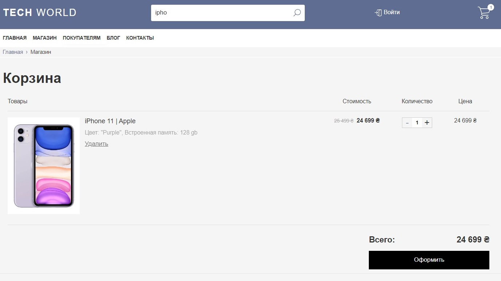
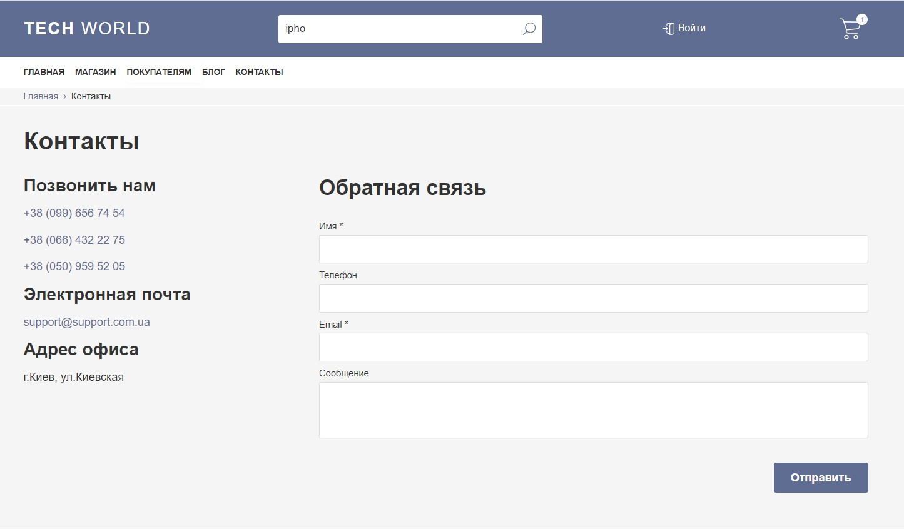

    <h2> O N L I N E &nbsp; S T O R E </h2>

## 📚 Project

An academic project designed to demonstrate knowledge of the React framework and other technologies. In this online store, there is work with the API, various requests to the server are implemented. Firebase was chosen as the basis of cloud storage, on which the Database is stored, as well as many photos.

 

## 🖥 Technologies

- Html
- Css/Sass
- Javascript
- React
- Redux
- Firebase
- API
- SPA

 

## 🚀 Features

<h3>Login/Register window</h3>

The user can log in by clicking on the "login" button located in the header of the site. After that, a sidebar will slide out, where you can enter your login information. After successful authentication, they will be saved and the user will log into his account. It is also possible to log in via facebook or google. If the user has not registered before, you can create an account.

    
    

 

<h3>Search</h3>

If the user wants to find a specific product, he just needs to enter a few letters, and he will be given all the products in the name of which there are such letters. It doesn't matter what case the letters are in.

    

 

<h3>More info about product</h3>

The user can click on the product he is interested in and see detailed information about it.

    

 

<h3>Add product to shopping cart</h3>

The user can add the product he is interested in to the cart by clicking on the "buy" button, after which the number of goods near the cart icon will change and the product will be added to the cart.

    
    

 

<h3>Shopping cart</h3>

The user can view their shopping cart by clicking on "edit" on the checkout page or by typing the url address - ".../react-web-shop/shop/basket". The shopping cart page will show all the items he has added.
P.S. after reloading the page, the selected products will not be saved

    
    

 

<h3>Feedback</h3>

If the user wants to get feedback, he can go to the contact page and submit a form with his data to contact him

    

<h2 align="center">
    <a href="https://g-nik1ta.github.io/react-web-shop/">live demo</a>
</h2>